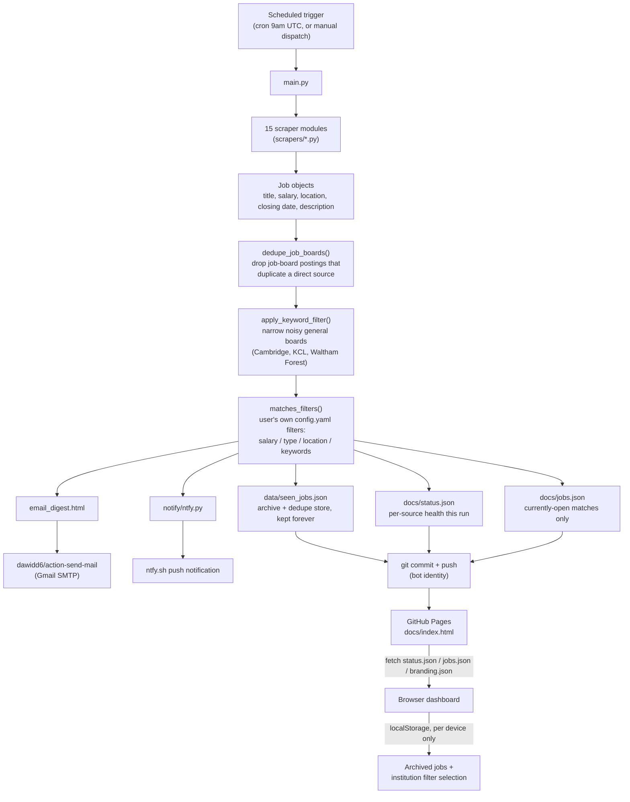

# Architecture

How this system is built and why. For day-to-day changes (filters, pausing a
source, branding, adding an institution), see [INSTRUCTIONS.md](INSTRUCTIONS.md)
instead — this file is about how the pieces fit together, not how to operate
them. Like INSTRUCTIONS.md, it lives at the repo root rather than in `docs/`,
so it's never served by the live dashboard site.

## Design constraint: zero paid infrastructure

Everything here runs on GitHub's free tier — no server, no database, no paid
API. The three building blocks:

- **GitHub Actions** — runs the scan on a schedule, does all the work.
- **Git-committed JSON files** — the "database". `data/` and `docs/*.json` are
  just files in the repo that a workflow run reads, updates, and commits back.
- **GitHub Pages** (serving `docs/`) — the status dashboard. Static HTML/JS,
  no build step, no backend of its own — it just fetches the JSON files above.

This constraint shapes several decisions documented below (why the dashboard
can't write back to the repo, why sync is a copy-paste code instead of a
server, why there's no real "accounts" system).

## End-to-end flow



One workflow run (`.github/workflows/daily-scan.yml`) does the entire left
side of that diagram in one Python process (`main.py`), then commits the
results back to the repo itself. The dashboard is just a passive reader of
whatever `main.py` last wrote.

## Repo layout

```
job-scraper/
  main.py                    # orchestrator — see "Pipeline order" below
  config.yaml                # user-editable filters (see INSTRUCTIONS.md)
  requirements.txt
  data/
    seen_jobs.json           # every job ever scraped, keyed by URL — the archive
  docs/                      # GitHub Pages root (the only publicly served folder)
    index.html               # dashboard — static HTML/CSS/vanilla JS
    status.json              # per-source health, overwritten every run
    jobs.json                # currently-open matches, overwritten every run
    branding.json            # per-institution colors/emoji/filter notes, generated
  scrapers/
    __init__.py               # SOURCES list — the registry of all 15 scrapers
    base.py                   # Job dataclass + shared helpers (see below)
    <institution>.py           # one module per source, each exports fetch_jobs()
  notify/
    branding.py               # SOURCE_BRANDING — static per-source display info
    email.py                  # builds the digest email body
    ntfy.py                   # posts push notifications to ntfy.sh
  tools/
    filters-editor.html        # LOCAL-ONLY tool — see "Why tools/ isn't in docs/"
  .github/workflows/
    daily-scan.yml             # the actual cron job
    test_email.yml             # manual smoke test
  INSTRUCTIONS.md              # operator's guide (day-to-day changes)
  ARCHITECTURE.md              # this file
```

## The `Job` model

Every scraper's `fetch_jobs()` returns a list of `scrapers.base.Job` — one
dataclass shared by all 15 sources regardless of how different their
underlying sites are:

```python
institution, title, url, salary_text, salary_annual_est, location_text,
is_london, employment_type, closing_date, first_seen, description
```

Two fields are worth calling out:

- **`salary_annual_est`** is always a *derived* integer (via `parse_salary()`
  in `base.py`), so `filters.salary_min` can compare apples to apples across
  sites that show salary as a range, an hourly rate, or a vague band.
- **`description`** is a best-effort excerpt (capped at `DESCRIPTION_MAX_LEN`
  = 2000 chars) of the job's own content, used only for keyword matching —
  never shown on the dashboard. Getting this field *right* turned out to be
  the hard part; see the section below.

Scrapers use one of three techniques depending on the source: `requests` +
BeautifulSoup for static HTML, Playwright for JS-rendered sites, or a direct
JSON API call when the site exposes one (Southbank Centre, Royal Academy,
National Gallery — much more reliable than scraping rendered HTML when
available).

## Two different "filters" — don't conflate them

The word "filter" means two distinct things in this codebase:

1. **`config.yaml`'s `filters` block** — the user's own preferences (salary
   minimum, full/part time, London or not, include/exclude keywords). Applied
   by `matches_filters()` in `base.py` to *every* source equally.
2. **`config.yaml`'s `keyword_filter` block** — a pre-filter applied only to
   specific *general* job boards (currently Cambridge, KCL, Waltham Forest)
   that aren't culture-sector-specific, to drop obviously irrelevant postings
   (HR roles, IT roles, etc.) before they ever reach step 1. Applied by
   `apply_keyword_filter()` in `main.py`.

Both now search title + institution + description (not just title) — but
that made (2) fragile in a way worth understanding, covered next.

## Why `description` needed a second pass: nav/boilerplate contamination

The naive approach — grab the whole rendered page's visible text as the
"description" — badly breaks keyword filtering, because career sites repeat
identical text on *every* job page, not just the one being scraped:

- Cambridge's site-wide nav bar permanently includes the literal links
  "Libraries" and "Museums and collections" on every single page. With
  full-page text search, that alone made every Cambridge job satisfy the
  culture-sector keyword filter, regardless of the job.
- Waltham Forest's job template includes a fixed employer-branding paragraph
  ("Bursting with **culture**, energy, and opportunity...") on every posting's
  own content block — not page nav, so it survives even isolating the main
  content area.

The fix, in `scrapers/base.py`:

- `extract_main_text(soup)` isolates `<article>` or `<main>` before falling
  back to the whole page, cutting out nav/footer chrome. Used for the
  `description` field specifically — the existing `page_text` used for
  salary/location/date label-scanning (`scan_common_fields()`) is left
  untouched, so this couldn't regress anything that already worked.
- `scrapers/waltham_forest.py` additionally strips its specific "About Us:"
  boilerplate paragraph by regex (`ABOUT_US_RE`), since that one survives
  `<main>`-isolation by being part of the job's own template.

If a new institution is added to `keyword_filter.sources` in the future and
starts showing suspiciously broad matches, this class of bug — site-wide
boilerplate leaking into `description` — is the first thing to check.

## Pipeline order (`main.py:main()`)

Roughly, per run:

1. Load `config.yaml` and `data/seen_jobs.json`.
2. **Backfill pass** over every already-seen record: re-normalize
   `closing_date` to long form, recompute `closing_date_iso`, and re-check
   `keyword_filter` matches (can only demote `matched: True → False`, never
   promote — see "Self-healing backfills" below).
3. Run all non-disabled scrapers (`run_scrapers()`), isolating failures per
   source so one broken scraper never blocks the others — this is what
   populates `docs/status.json`.
4. `dedupe_job_boards()` — drop aggregator listings that duplicate a direct
   source's posting this run.
5. `apply_keyword_filter()` — narrow the general-board sources.
6. For genuinely new jobs (`url` not already in `seen_jobs`): stamp
   `first_seen`, normalize the closing date, run `matches_filters()`, store
   the record.
7. Save `seen_jobs.json`, `status.json`, `branding.json`.
8. Compute `docs/jobs.json` = matched records that haven't closed yet, capped
   at `MAX_RECENT_JOBS` (1000 — this is just a sanity cap, not the real
   mechanism keeping the list small; closing-date expiry does that).
9. Build and print the email digest (stdout — the workflow greps this for
   `FOUND` to decide whether to send an email at all).
10. Send ntfy push for new matches, unless `push_notifications_enabled: false`.

### Self-healing backfills

`data/seen_jobs.json` records are written once at `first_seen` and otherwise
never touched again — so any new piece of logic (date formatting, keyword
matching) that should apply retroactively to already-seen jobs needs an
*explicit* backfill pass, or those old records silently never update. Both
`normalize_closing_date()` and `reapply_keyword_filter_to_seen()` exist for
exactly this reason, and both re-run unconditionally on every scan (cheap —
pure string parsing, no network calls) rather than only "if missing", so they
also self-heal if the JSON file itself ever gets corrupted by something like
a bad merge.

## Why `tools/` isn't in `docs/`

`docs/` is the *only* folder GitHub Pages serves — anything in it is public
and live on the internet. A public static page has no secure place to hold
credentials, so it can never safely write back to the repo itself (no GitHub
token can be embedded in its JS without exposing it to anyone who views page
source). `tools/filters-editor.html` generates a new `config.yaml` for you to
manually download/paste and commit yourself via GitHub Desktop — it's a local
convenience tool, not a live admin panel, and living outside `docs/` is what
keeps that distinction enforceable rather than just a convention.

The same reasoning killed an earlier design for cross-device archive sync: a
Gist-backed version would have needed a GitHub token embedded in the public
dashboard's JS to let it write to a Gist, and a gist-scoped token can read/
write *all* of a user's gists, not just one. Instead, archiving
(`docs/index.html`'s Archive button) is pure `localStorage` — private to each
browser/device by design, nothing to leak — and moving that state between
devices is a manual copy-pasted code (base64 of the archived URL list) via
the dashboard's "Sync archive" panel, with no server and no credentials
involved anywhere.

## Notifications

- **Email**: `main.py` writes `email_digest.html`; the workflow's
  `dawidd6/action-send-mail` step sends it via Gmail SMTP using repo secrets
  (`EMAIL_USERNAME`, `EMAIL_PASSWORD`, `EMAIL_TO`) — only runs `if:
  env.MATCH_FOUND == 'true'`.
  the workflow greps `main.py`'s stdout for the literal string `FOUND` to set
  that flag.
- **Push**: `notify/ntfy.py` posts one HTTP request per matched job to
  `ntfy.sh/{topic}`, where `{topic}` is the `NTFY_TOPIC` repo secret — the
  topic name *is* the access control (ntfy has no accounts), so it should
  stay an unguessable slug. Silently no-ops if the secret isn't set (e.g.
  local test runs). Fully suppressible without code changes via
  `config.yaml`'s `push_notifications_enabled: false`.

## Recurring operational risks (things that have actually happened)

- **Scheduled runs racing local work**: the daily workflow commits its own
  scan results (`data/seen_jobs.json`, `docs/*.json`) straight to `main`
  independent of any local changes to those same files — a real merge
  conflict has happened this way. Safe resolution pattern when it recurs:
  take the bot's version of just the data files
  (`git checkout --theirs -- data/seen_jobs.json docs/jobs.json
  docs/status.json`), then re-run `python main.py` locally to reapply
  whatever local logic changes were in flight — the backfills described above
  make this safe, since they're idempotent.
- **Site redesigns break individual scrapers silently** (until the next run,
  when they show up as `error` on the dashboard) — British Museum's locale-
  dependent server error and URL restructuring is the canonical example.
  Each scraper isolates its own failure (`run_scrapers()`'s per-source
  try/except); one broken source never takes down the rest of the scan.
- **Flaky DNS inside headless Chromium**: Oracle Cloud HCM (Waltham Forest)
  intermittently fails DNS resolution inside Playwright even though the OS
  resolver has no issue with it — mitigated by `goto_with_retry()` in
  `base.py`, not a real network outage.
- **Rate limiting during local testing**: KCL's site throttles repeated
  requests from the same IP in quick succession. This has repeatedly looked
  like a real bug during manual re-testing; it isn't — production's daily
  cron uses a fresh GitHub Actions IP each run and is unaffected.
